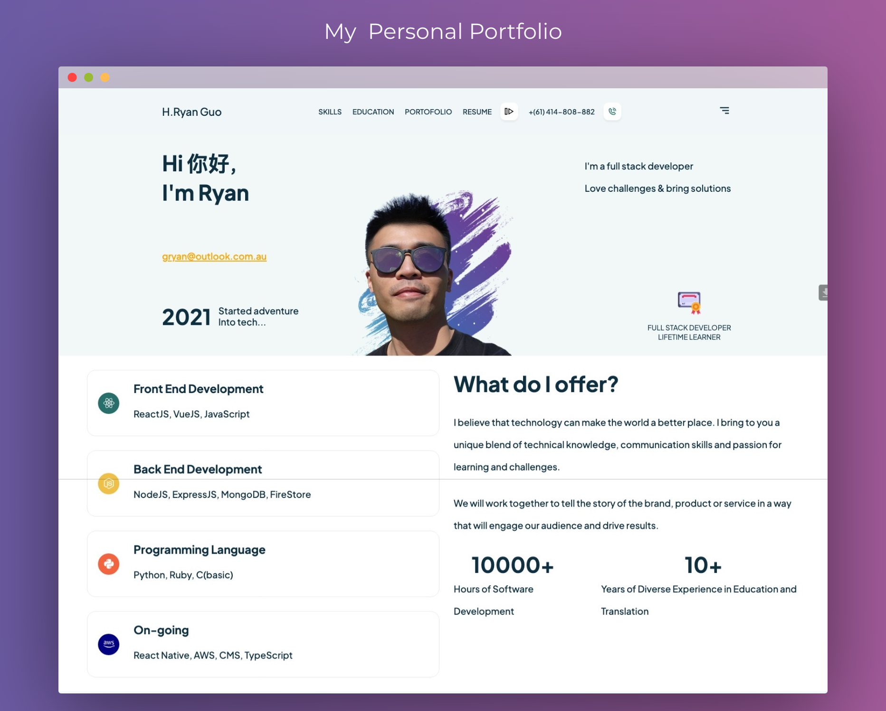

#  Ryan Haoran Guo

**`Career 2.0: 🌈 Leveraging Past Experience in My New Software Engineering Journey`**

I'm a full-stack developer with an insatiable curiosity for learning and connecting with new people. Transitioning from a bilingual professional to a full-time techie, I bring years of experience bridging people and communication into the world of software. I'm still relatively new to tech, and I'm okay with that — I'd rather embrace the learning curve than pretend I've got it all figured out. I build my own projects from the ground up, learn from developers I admire, and get a little better every day. Always happy to connect with fellow tech enthusiasts, so reach out any time!

    
    
    
    

---

### 🛠️ Languages and Tools

  

🌱 **Currently learning:** Big Data Management (MapReduce, Hadoop) as part of my Master of Information Technology at UNSW.

---

### 🥑 My Projects

<table>
  <tr>
      <td>
        <strong>Personal Portfolio | React, Motion CSS</strong> 
        
    </td>
    <td>
        <strong>TutoNet | Vue3, Quasar Framework, Supabase</strong> 
        
    </td>
    <td>
        <strong>QuizCraft | React, CSS, Firestore</strong> 
        
    </td>
  </tr>
</table>

---

### 📊 GitHub Stats

<table>
  <tr>
    <td>
      
    </td>
    <td>
      
    </td>
  </tr>
</table>

---

## More About Me

<h3>🎓 My Education</h3>

- **Master of Information Technology (Part-Time)**
  _May 2023 - Present_
  University of New South Wales
  - Furthering my knowledge in advanced computing

- **Certificate of Software Engineering Immersive**
  _December 2022 - March 2023_
  General Assembly Australia
  - Completed 6 major full-stack web application projects
  - Built a strong foundation in Agile development and microservices
  - Collaborated with developers and UX/UI teams across 3 web application builds

- **Graduate Certificate in Computing**
  _February 2022 - November 2022_
  University of New South Wales
  - WAM: 72.25
  - Gained comprehensive training in algorithms, OOP in Python, and discrete maths

- **Undergraduate Certificate in Data Engineering**
  _June 2017 - November 2018_
  TAFE NSW
  - Graduated with Distinction
  - Researched and built skills in designing, implementing, and managing big data systems and infrastructure
  - Gained experience in Python and R for data analysis

- **Master of Conference Interpreting**
  _February 2017 - November 2018_
  Macquarie University
  - Graduated with Distinction
  - Combined theoretical knowledge with hands-on conference interpreting experience

- **Master of Translation and Interpreting Studies**
  _July 2010 - November 2011_
  University of New South Wales
  - Graduated with Distinction
  - Developed translation and interpreting skills across Australian community settings
  - Acquired NAATI translator and interpreter credentials

<h3>👔 Previous Work Experience</h3>

- **Community Interpreter**
  _June 2013 - Present_
  Oncall Interpreters
  - Interpreted over 2,000 cases across legal, healthcare, government, and business settings
  - Maintained up to 90% positive feedback, consistently meeting and exceeding client expectations

- **Conference Interpreter**
  _September 2016 - Present_
  Freelance
  - Provided simultaneous interpretation for 200+ professional events across finance, technology, and health
  - Trusted by high-profile clients including the Australian Prime Minister's office, the Reserve Bank of Australia, and Pfizer

- **Academic Manager**
  _January 2022 - January 2023_
  Sydney Institute of Interpreting and Translating
  - Managed 50 tutors and 1,000 students across three campuses for academic performance and compliance
  - Initiated and managed an eLearning suite in collaboration with an external IT team — my first taste of managing tech-focused projects

- **Head Trainer & Tutor**
  _June 2012 - January 2023_
  Sydney Institute of Interpreting and Translating, Sydney
  - Developed teaching and assessment materials for 3 programs
  - Supervised over 100 cohorts and helped 2,000+ students earn NAATI credentials
  - Awarded Employee of the Year in 2016 and 2020

